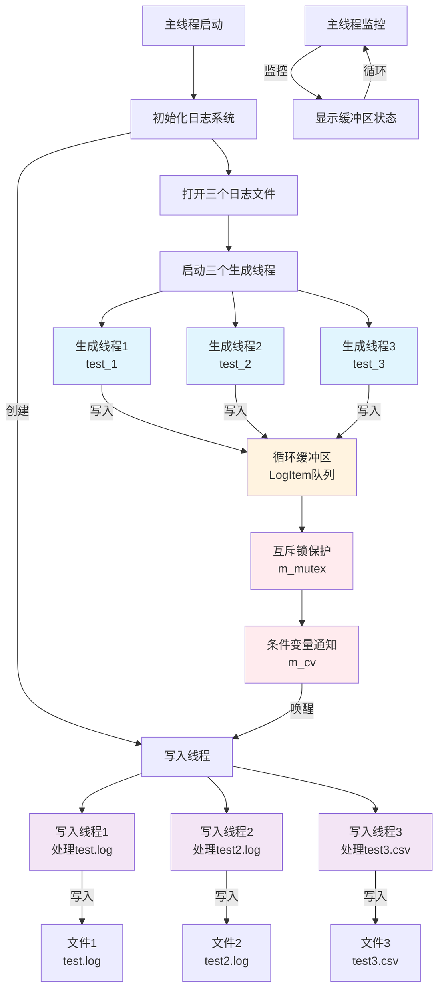

# zhh-log 多线程流程图

## 三个线程生成信息 + 三个线程写入的基本流程

## 详细流程说明

### 1. 初始化阶段
- 主线程启动日志系统
- 打开三个不同的日志文件
- 创建循环缓冲区

### 2. 线程启动阶段
- **生成线程**: 三个线程分别生成不同类型的日志数据
- **写入线程**: 三个线程分别处理对应的日志文件

### 3. 数据流转阶段
- 生成线程将日志数据写入循环缓冲区
- 使用互斥锁保证线程安全
- 条件变量通知写入线程有新数据

### 4. 文件写入阶段
- 写入线程从缓冲区读取数据
- 根据文件ID写入对应文件
- 持续监控缓冲区状态

## 线程职责分工

| 线程类型 | 线程名称 | 职责 | 输出文件 |
|---------|---------|------|---------|
| 生成线程1 | test_1 | 生成INFO级别日志 | test.log |
| 生成线程2 | test_2 | 生成WARN级别日志 | test2.log |
| 生成线程3 | test_3 | 生成CSV格式数据 | test3.csv |
| 写入线程1 | loop() | 处理test.log数据 | test.log |
| 写入线程2 | loop() | 处理test2.log数据 | test2.log |
| 写入线程3 | loop() | 处理test3.csv数据 | test3.csv |

## 关键组件

### 循环缓冲区
- 固定大小的LogItem队列
- 原子操作管理读写索引
- 支持高并发访问

### 线程同步
- 互斥锁(m_mutex)保护共享资源
- 条件变量(m_cv)实现线程间通信
- 原子变量管理运行状态

### 文件管理
- 文件ID映射机制
- 多文件并发写入
- 自动文件刷新
